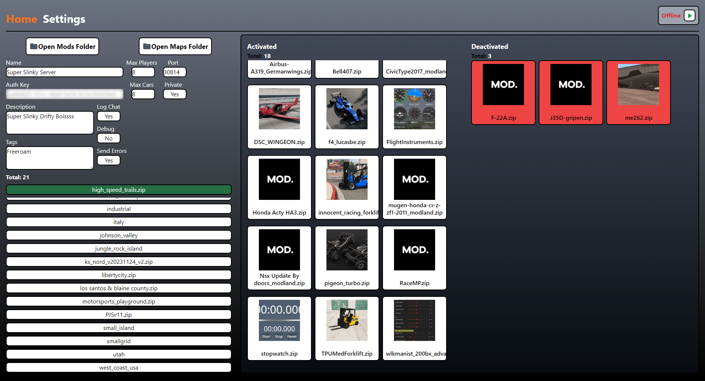
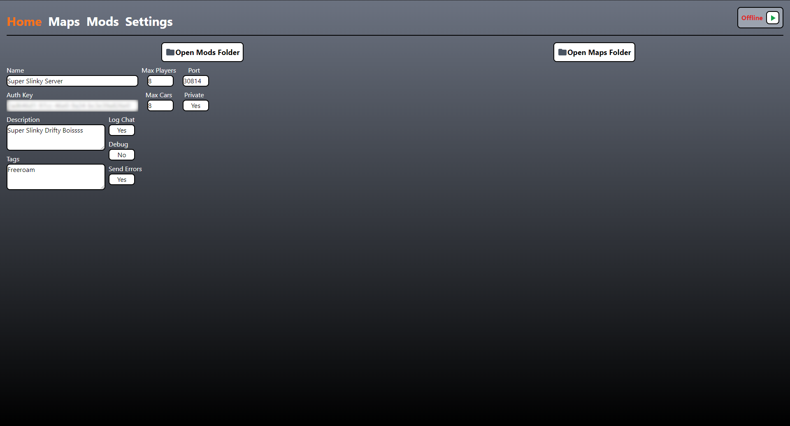
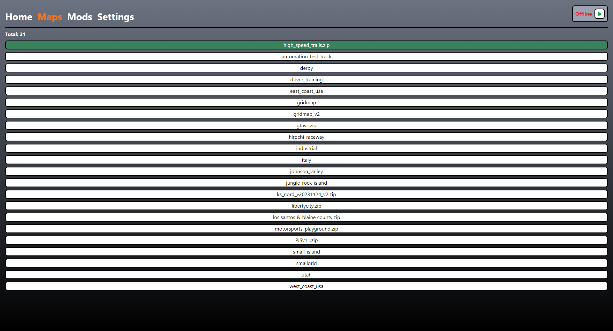
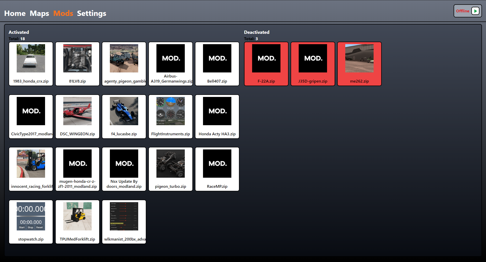
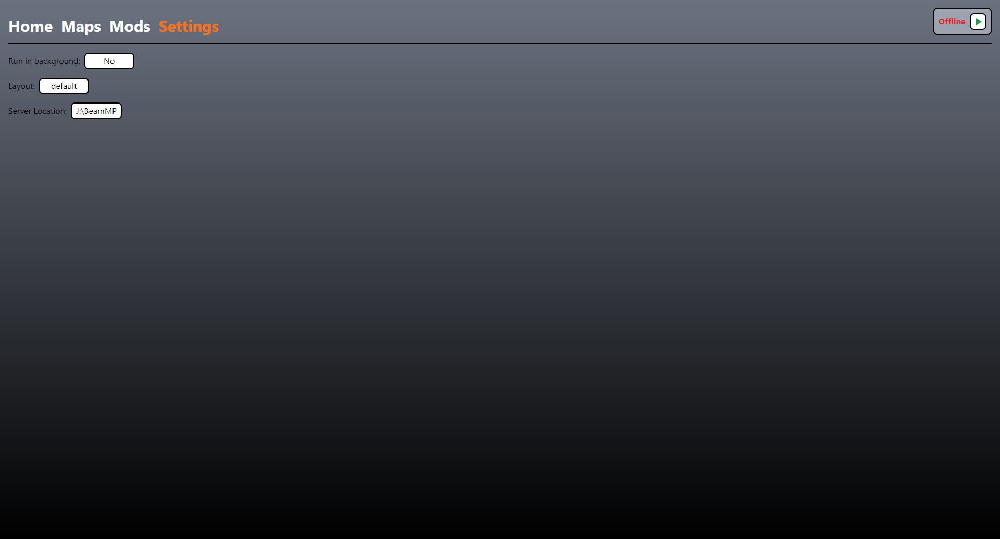

# BeamMP Manager

BeamMP Manager is a powerful tool designed to manage BeamMP servers efficiently. Built with Electron and React, this application provides a user-friendly interface for server administrators to control and customize their BeamMP game servers.

## Preview

  
  
  
  
  

## Features

### Server Management

- Start and stop BeamMP servers with ease
- Monitor server status in real-time
- Execute server commands directly from the application

### Configuration

- Edit server settings through a user-friendly interface
- Manage server configuration files (ServerConfig.toml)
- Customize server name, description, and other parameters

### Map Management

- Browse and select custom maps for your server
- Easy installation and management of custom maps

### Mod Support

- View and manage server mods
- Extract and display mod information, including images

### User Interface Customization

- Choose between different layout options

### Development Tools

- Built-in developer tools for debugging and testing

## Technical Details

- **Framework**: Electron with React
- **Language**: TypeScript/JavaScript
- **Packaging**: electron-builder for creating distributable packages
- **Build Process**: Webpack for bundling and optimization
- **Testing**: Jest for unit testing

## Installation

1. Download the latest release for your operating system from the [releases page](https://github.com/TheBiggestTrees/beammp-manager/releases).
2. Install the application following the standard procedure for your OS.

## Usage

1. Make sure your BeamMP server has map `automation_test_track` selected in the ServerConfig.toml file.
2. Launch the BeamMP Manager application.
3. Set your BeamMP server folder in the settings.
4. Use the intuitive interface to manage your server, mods, and maps.
5. Start your server and enjoy!

## Development

To set up the development environment:

1. Clone the repository
2. Run `npm install` to install dependencies
3. Use `npm start` to run the application in development mode

## Build

To build the application for distribution:

1. Ensure you have all dependencies installed by running `npm install`
2. Run the build command for your target platform:
   - For Windows: `npm run package`
3. The packaged application will be available in the `release/build` directory

For more detailed build instructions and troubleshooting, please refer to the [electron-builder documentation](https://www.electron.build/).

## License

This project is licensed under the MIT License - see the [LICENSE](LICENSE) file for details.

## Support

For support, please open an issue on the GitHub repository or contact the maintainers directly.

## Acknowledgments

- BeamMP community for their continuous support and feedback
- Electron and React teams for providing excellent frameworks
